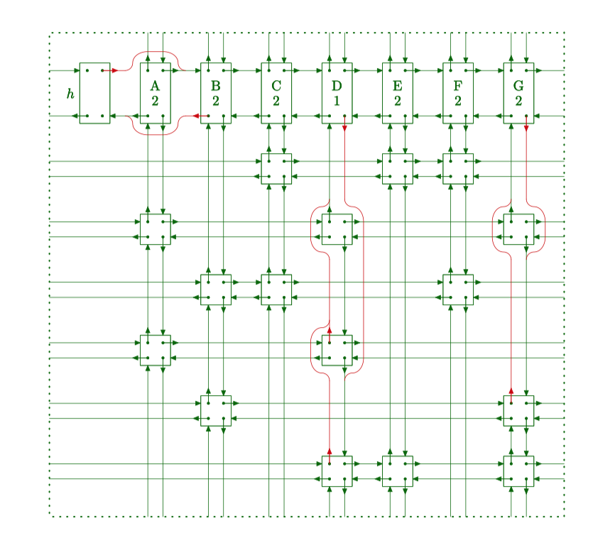
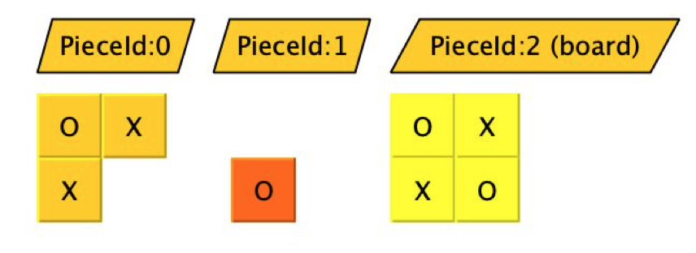
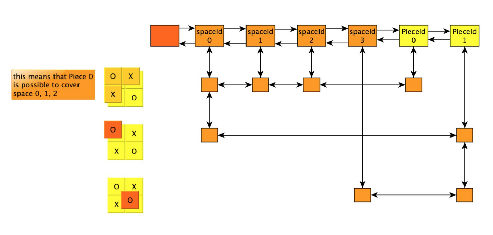
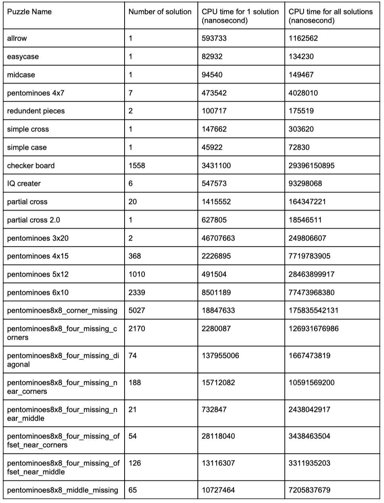
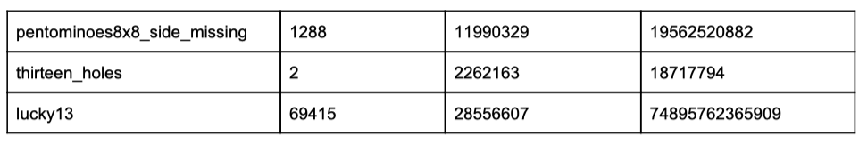
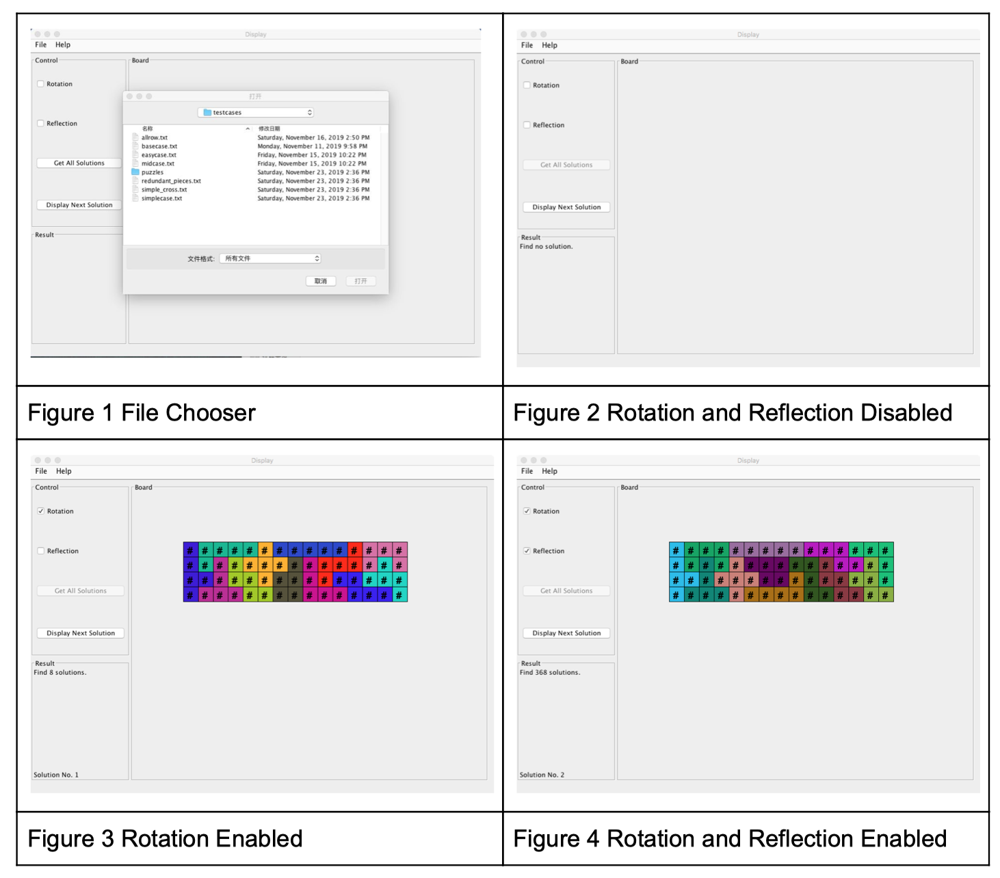

# Tiling_Puzzle_Solver

Done by Yufeng Yan and Shilin Yan

JDK version: 1.8

Dev Env: Mac OS X version 10.14.6

Graph Editor: yEd

## Overview
We implement a program that will solve arbitrary tiling puzzles. The program implements a reasonably GUI and is able to directly read the input ASCII file from GUI.

## BackGround && Requirement
[./doc/Requirement.pdf](./doc/Requirement.pdf)

## Reference

> Dancing Links -- Donald E. Knuth, Stanford University

[./doc/DancingLink.pdf](./doc/DancingLink.pdf)

## Algorithm Description

The core algorithm to solve the tiling puzzle is Dancing Links, which is proposed by Donald E. Knuth. We can classify the Tiling Puzzle Problem as the exact cover problem. To implement the Dancing Links algorithm, the first thing we need to do is to turn the Tiling Puzzle Problem to a circular linked list. We need to create list headers to represent the cells of the board and the tile pieces to fill the board. And then create rows that represent the possible positions to the headers.

For example, if we have two pieces and one board as following.

The following shows the main strategy to set rows. As the first pieces only have one possible position on the board, there is only one row. This row connects speceId0, speceId1, speceId2 and PieceId0, which means it occupies 3 blocks and uses the first piece. And so on.

Additionally, we changed one of the boundary conditions of the algorithm. We create a counter to count the number of cells that have been occupied. Once the number is equal to the number of all the cells, we extract the solution to the solutions set.

## Results

The following table shows the output for all puzzles our program is able to solve.

## GUI Screenshot

We use pentominoes4x15 as the example to show how the GUI works. We enable users to choose from local inputs as shown in figure 1. We allow users to configure the tile rotation and reflection. In this case, if both rotation and reflection are disabled, no solution will be returned. If we only enable rotation, 8 solutions are found. If we enable both rotation and reflection, 368 solutions will be found.

